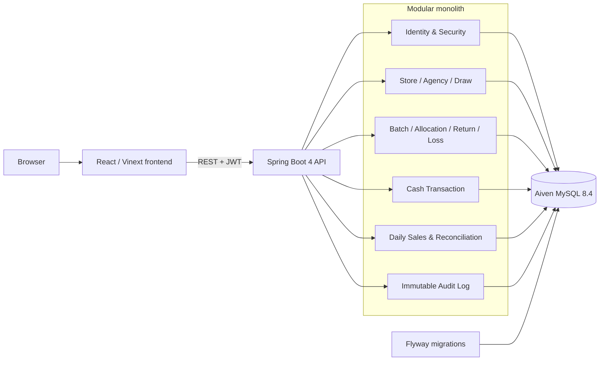
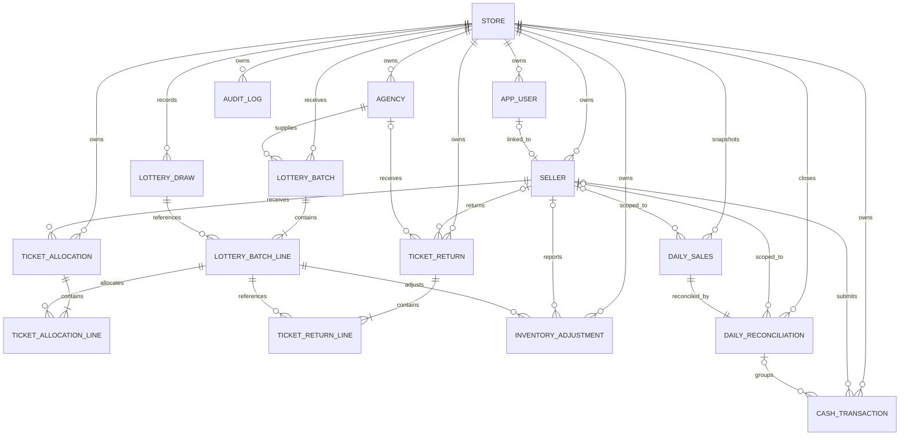
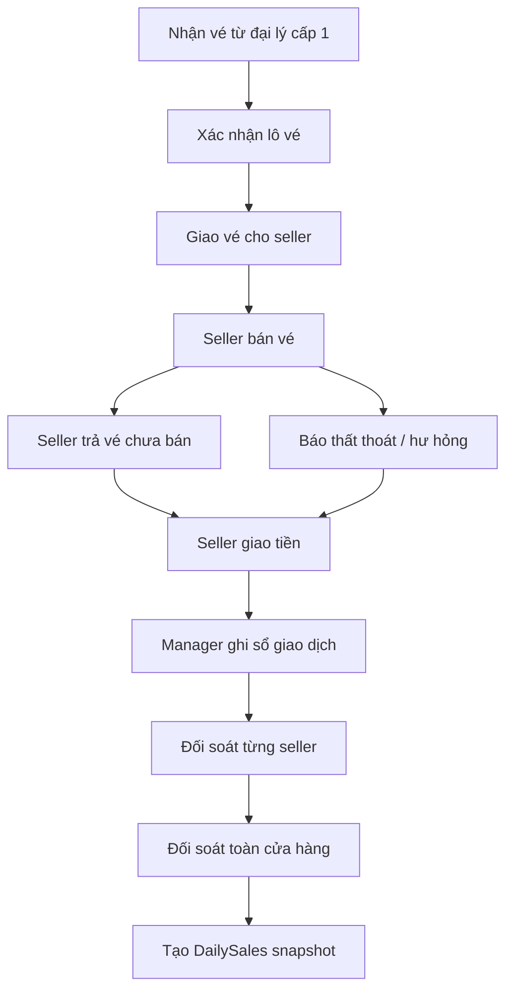
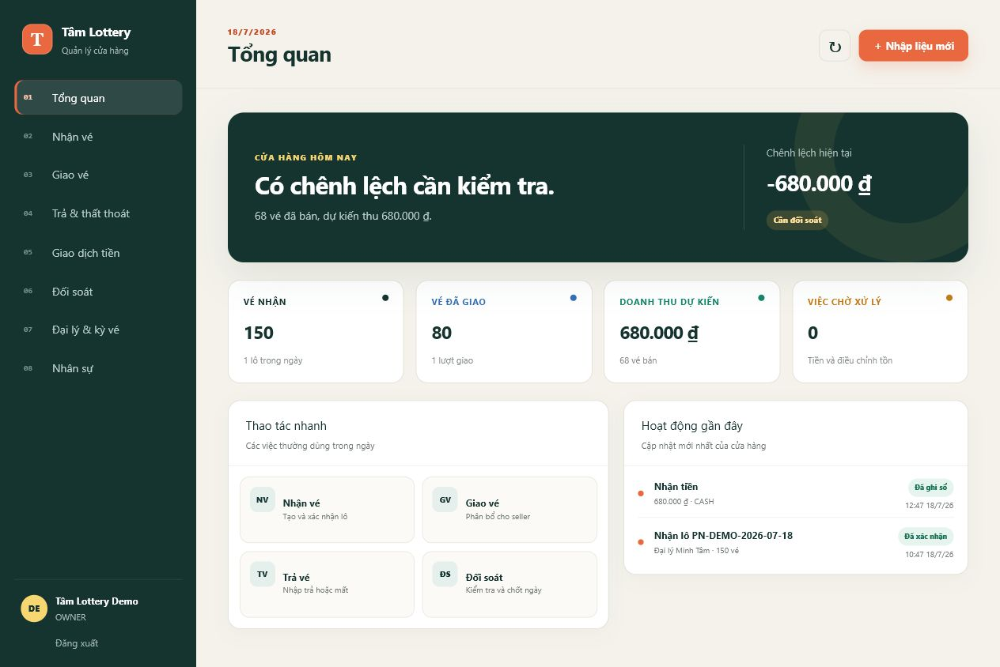
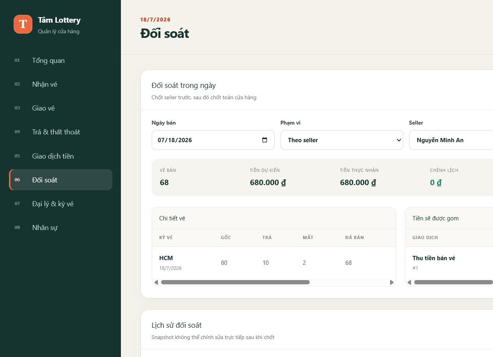
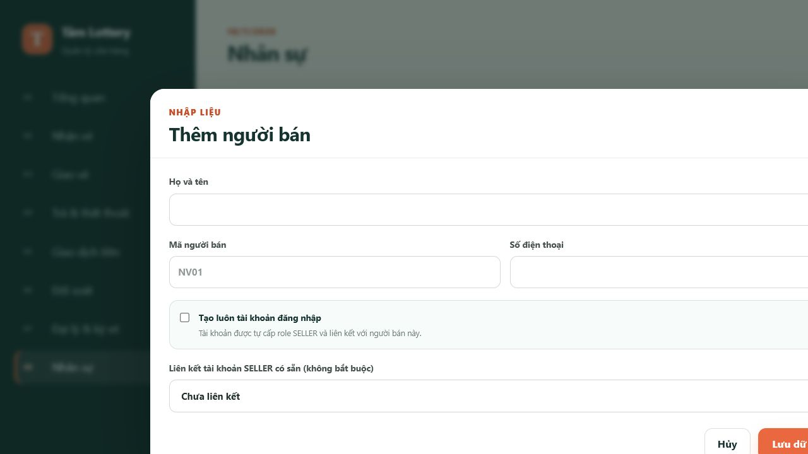

# TamLottery

[](https://github.com/mtriet004/TamLottery/actions/workflows/ci.yml)

TamLottery là MVP quản lý vận hành dành cho cửa hàng vé số cấp 2. Hệ thống theo dõi vòng đời vé và tiền từ lúc nhận vé của đại lý cấp 1 đến khi đối soát seller và chốt toàn cửa hàng.

> Real-world project được xây dựng từ quy trình của một cửa hàng vé số gia đình.

## Tính năng chính

- Phân quyền `OWNER`, `MANAGER`, `SELLER` bằng JWT và refresh-token rotation.
- Quản lý store, user, seller và đại lý cấp 1.
- Nhận lô vé bằng form hoặc import CSV/XLSX có bước preview.
- Giao vé, trả vé và ghi nhận thất thoát.
- Ghi nhận, xác nhận và hủy giao dịch tiền.
- Đối soát seller trước, sau đó đối soát toàn cửa hàng.
- DailySales snapshot không cho chỉnh sửa trực tiếp sau khi chốt.
- Audit log append-only lưu actor, action, lý do, request ID và snapshot trước/sau.
- Store isolation và seller isolation tại backend.
- Transaction, pessimistic locking, `@Version` và unique constraints chống oversell/trùng dữ liệu.
- Docker, Aiven MySQL, Flyway, JUnit và MySQL Testcontainers.

## Kiến trúc



Backend được triển khai dưới dạng modular monolith vì hệ thống hiện phục vụ cửa hàng nhỏ, cần transaction chặt chẽ nhưng chưa có nhu cầu vận hành microservice hoặc message broker.

## ERD rút gọn



ERD đầy đủ được quản lý bằng Flyway tại `src/main/resources/db/migration`.

## Luồng nghiệp vụ



Quy tắc chính:

```text
Seller sold = allocated - seller returns - approved seller losses
Store sold  = received - agency returns - all approved losses
Expected revenue = Σ(sold quantity × unit sale price at batch line)
Difference = actual received - expected revenue
```

`SELLER_TO_STORE` chỉ chuyển tồn từ seller về cửa hàng. Chỉ `STORE_TO_AGENCY` mới làm giảm tổng vé của cửa hàng.

`STORE_TO_AGENCY` chỉ được tạo và xác nhận trước thời điểm `returnCutoffAt` do đại lý cấp 1 quy định. Seller vẫn có thể trả vé về cửa hàng sau mốc này, nhưng cửa hàng không thể chuyển số vé đó tiếp về đại lý.

## Screenshot

### Dashboard owner



### Đối soát seller



### Tạo người bán và tài khoản



Kịch bản quay video demo 2–3 phút nằm tại [docs/demo-script.md](docs/demo-script.md).

## Tài khoản và dữ liệu demo

Profile `demo` tạo một store cách ly cùng dữ liệu mẫu. Profile này không được bật khi chạy bình thường.

| Vai trò | Username | Password |
|---|---|---|
| Owner | `demo.owner.v01` | `Demo@12345` |
| Seller | `demo.seller.v01` | `Demo@12345` |

Dữ liệu mẫu gồm:

- Một đại lý cấp 1.
- Một lô 150 vé TP.HCM.
- Giao 80 vé cho seller.
- Seller trả 10 vé, thất thoát 2 vé và bán ước tính 68 vé.
- Một giao dịch seller giao đủ `680.000đ`, đã được ghi sổ.
- 80 vé tồn tại cửa hàng được trả về đại lý.

Tạo dữ liệu demo một lần trên database đang cấu hình trong `.env`:

```powershell
docker compose run --rm `
  -e SPRING_PROFILES_ACTIVE=aiven,demo `
  app
```

Seeder có tính idempotent theo username owner demo. Chạy lại sẽ không tạo dữ liệu trùng.

## Yêu cầu môi trường

- Java 25.
- Node.js 22.13 trở lên.
- Docker Desktop.
- MySQL 8.4 hoặc Aiven MySQL.
- `JAVA_HOME` trỏ tới JDK 25.

## Chạy bằng Docker và Aiven

Tạo `.env` từ file mẫu và điền credential Aiven/JWT:

```powershell
Copy-Item .env.example .env
docker compose up -d --build
```

Compose chỉ chạy backend và frontend; không tạo MySQL local. Không commit `.env`.

| Thành phần | URL mặc định |
|---|---|
| Frontend | `http://localhost:3000` |
| Backend | `http://localhost:8080` hoặc `APP_PORT` trong `.env` |
| Healthcheck | `GET /actuator/health` |
| Swagger UI | `GET /swagger-ui.html` |
| OpenAPI JSON | `GET /v3/api-docs` |

## Chạy backend local

```powershell
$env:JAVA_HOME='C:\Program Files\Java\jdk-25.0.3'
$env:SPRING_PROFILES_ACTIVE='local'
$env:DB_URL='jdbc:mysql://localhost:3306/tam_lottery'
$env:DB_USERNAME='tam_lottery'
$env:DB_PASSWORD='tam_lottery'
$env:JWT_SECRET='BASE64_ENCODED_SECRET_AT_LEAST_32_BYTES'
.\mvnw.cmd spring-boot:run
```

## Chạy frontend local

```powershell
Set-Location frontend
npm ci
npm run dev
```

Frontend mở tại `http://localhost:3000` và proxy `/api` về backend.

## Postman

Import hai file:

- [TamLottery.postman_collection.json](docs/postman/TamLottery.postman_collection.json)
- [TamLottery.local.postman_environment.json](docs/postman/TamLottery.local.postman_environment.json)

Request login tự lưu `accessToken` và `refreshToken`. Collection chứa luồng MVP từ tạo người bán/đại lý đến đối soát.

Collection đã được chạy end-to-end với 24 request và 10 assertion. Vì bước cuối chốt ngày, hãy chạy một lần cho mỗi `businessDate` hoặc dùng một store/database demo mới khi muốn chạy lại.

## Kiểm thử

Unit test:

```powershell
.\mvnw.cmd test
```

Integration test trên MySQL 8.4 Testcontainers:

```powershell
.\mvnw.cmd clean verify -Pintegration-tests
```

Frontend:

```powershell
Set-Location frontend
npm ci
npm run lint
npm run build
```

Trạng thái release `v0.1.0`:

```text
12 unit tests
12 integration tests
Frontend lint/build
Docker backend/frontend healthcheck
```

GitHub Actions chạy backend integration tests và frontend lint/build trên mỗi push/PR.

## Tài liệu bổ sung

- [Ghi chú thiết kế và chuẩn bị phỏng vấn](docs/tamlottery-interview-notes.md)
- [Kịch bản demo 2–3 phút](docs/demo-script.md)
- [Postman collection](docs/postman/TamLottery.postman_collection.json)
- [Production operations runbook](docs/operations-runbook.md)

## Audit log

`GET /api/v1/audit-logs` dành cho `OWNER` và `MANAGER`, tự giới hạn theo store trong JWT. API hỗ trợ lọc theo `action`, `entityType`, `entityId`, `actorUserId`, `fromTime`, `toTime` và pagination.

Audit được ghi cùng transaction với thay đổi nghiệp vụ. Bảng không có API sửa/xóa, entity là immutable và production application user chỉ được cấp `SELECT/INSERT` trên `audit_log`. Password, JWT và refresh token không được đưa vào snapshot.

## Roadmap sau MVP

- Lottery result và quy trình trả thưởng.
- Export Excel/PDF.
- CI/CD deployment.

## Release

Phiên bản MVP đầu tiên: `v0.1.0`.
